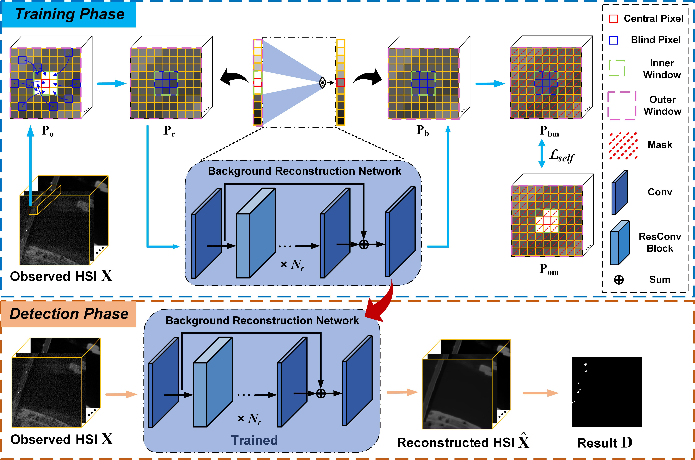

# DirectNet
This is the official repository for  ["Sliding Dual-Window-Inspired Reconstruction Network for Hyperspectral Anomaly Detection"](https://ieeexplore.ieee.org/abstract/document/10400466) in IEEE Transactions on Geoscience and Remote Sensing (TGRS). 



## Abstract

Hyperspectral anomaly detection (HAD) aims to identify anomalous objects that deviate from surrounding backgrounds in an unlabeled hyperspectral image (HSI). Most available neural networks that make use of the reconstruction error to perform HAD tend to fit both backgrounds and anomalies, resulting in small reconstruction errors for both and not being effective in separating targets from background. To address this issue, we develop Dual-window-inspired reconstruction Network (DirectNet), a new background reconstruction network for HAD that seamlessly integrates a sliding dual-window model into a blind-block architecture. Concretely, DirectNet establishes an inner window within the network's receptive field by erasing the center block information so that the content of the inner window remains invisible during the reconstruction of the central pixel. In addition, the depth of our reconstruction network is adaptive to the size of the input image patch, ensuring that the network's receptive field aligns with the dimensions of the input patch. The receptive field outside the inner window is considered an outer window. This weakens the impact of anomalies on the reconstruction process, causing the reconstructed pixels to converge toward the background distribution in the outer window region. Consequently, the reconstructed HSI can be regarded as a pure background HSI, leading to further amplification of reconstruction errors for anomalous targets. This enhancement improves the discriminatory ability of DirectNet. Specifically, DirectNet solely utilizes the outer window information to predict/reconstruct the central pixel. As a result, when reconstructing pixels inside anomalous targets of different sizes, the targets primarily fall within the inner window. Comprehensive experiments (conducted on four datasets) demonstrate that DirectNet achieves competitive performance compared to other state-of-the-art detectors.

## Setup

### Requirements

Our experiments are done with:

- Python 3.9.12
- PyTorch 1.12.1
- numpy 1.21.5
- scipy 1.7.3
- torchvision 0.13.1

## Prepare Dataset

Put the data(.mat [data, map]) into ./data

## Training and Testing

### Training
```shell
python main.py --command train --dataset Pavia --batch_size 100 --epochs 1000 --learning_rate 1e-4 --win_out 19 --win_in 3 --gpu_ids 0
```

### Testing
```shell
python main.py --command predict --dataset Pavia --batch_size 100 --epochs 1000 --learning_rate 1e-4 --win_out 19 --win_in 3 --gpu_ids 0
```

- If you want to Train and Test your own data, you can change the input dataset name (dataset) and tune the parameters, such as Learning rate (learning_rate), Outer window size (win_out), and Inner window size (win_in).

## Citation

If the work or the code is helpful, please cite the paper:

```
@article{wang2024directnet,
   author = {Wang, Degang and Zhuang, Lina and Gao, Lianru and Sun, Xu and Zhao, Xiaobin and Plaza, Antonio},
   title = {Sliding Dual-Window-Inspired Reconstruction Network for Hyperspectral Anomaly Detection},
   journal = {IEEE Trans. Geosci. Remote Sens.},
   volume = {62},
   pages = {1-15},
   DOI = {10.1109/TGRS.2024.3351179},
   year = {2024}
}
```

## Acknowledgement

The codes are based on [Noise2Void](https://github.com/hanyoseob/pytorch-noise2void) and [BS<sup>3</sup>LNet](https://github.com/DegangWang97/IEEE_TGRS_BS3LNet). Thanks for their awesome work.

## Contact
For further questions or details, please directly reach out to wangdegang20@mails.ucas.ac.cn
